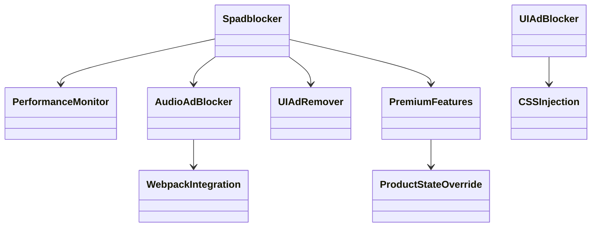

# Spadblocker Extension Development Guide

## Overview

Spadblocker is a comprehensive Spotify ad blocker extension that eliminates ads and unlocks premium features for free users. This guide covers extension development, architecture, and best practices.

## Table of Contents

- [Extension Structure](#extension-structure)
- [Getting Started](#getting-started)
- [Architecture](#architecture)
- [API Usage](#api-usage)
- [Development Workflow](#development-workflow)
- [Testing](#testing)
- [Deployment](#deployment)
- [Best Practices](#best-practices)
- [Troubleshooting](#troubleshooting)

---

## Extension Structure

### File Organization

```
spadblocker/
├── src/
│   └── spadblocker.js          # Main extension file
├── scripts/
│   ├── build.cjs               # Build script
│   ├── version.cjs             # Version management
│   └── dev.js                  # Development script
├── dist/
│   ├── spadblocker.js          # Built extension
│   ├── spadblocker.min.js      # Minified version
│   ├── package/               # Installation package
│   └── version.json           # Version information
├── docs/                      # Documentation
├── package.json               # Project configuration
└── README.md                  # Project readme
```

### Installation Location

Extensions are single JavaScript files placed in:

```bash
# Windows
%appdata%\spicetify\Extensions\

# Linux/macOS
~/.config/spicetify/Extensions/
```

---

## Getting Started

### Prerequisites

- Node.js 18.0.0 or higher
- Spicetify CLI installed
- Spotify desktop app

### Quick Start

1. **Clone the repository**
   ```bash
   git clone https://github.com/keparlak/spadblocker.git
   cd spadblocker
   ```

2. **Install dependencies**
   ```bash
   npm install
   ```

3. **Build the extension**
   ```bash
   npm run build
   ```

4. **Deploy to Spotify**
   ```bash
   npm run version:deploy
   spicetify apply
   ```

### Minimal Extension Template

```javascript
(function initializeSpadblocker() {
  // Wait for Spicetify to be ready
  if (!Spicetify?.Player || !Spicetify?.Platform) {
    setTimeout(initializeSpadblocker, 100);
    return;
  }

  console.log('Spadblocker: Extension loaded');
  // Your extension code here
})();
```

---

## Architecture

### Core Components

#### 1. **PerformanceMonitor**
- Tracks extension performance metrics
- Monitors initialization time
- Provides debugging information

#### 2. **WebpackIntegration**
- Integrates with Spotify's webpack modules
- Extracts ad-related functions
- Manages module caching

#### 3. **AudioAdBlocker**
- Blocks audio advertisements
- Manages ad slots and settings
- Disables Spotify ad managers

#### 4. **UIAdRemover**
- Removes UI ad elements
- Injects CSS to hide ads
- Uses MutationObserver for dynamic content

#### 5. **PremiumFeatures**
- Overrides product state
- Enables premium features
- Maintains premium overrides

### Class Hierarchy



---

## API Usage

### Spicetify Namespaces

```javascript
// Core APIs
Spicetify.Player      // Player controls and events
Spicetify.Platform    // Platform information
Spicetify.CosmosAsync  // API requests
Spicetify.LocalStorage // Data storage
Spicetify.Topbar      // Top bar customization
Spicetify.ContextMenu // Context menu items
```

### Common Patterns

#### Waiting for Spicetify

```javascript
async function waitForSpicetify() {
  const MAX_RETRIES = 50;
  const RETRY_DELAY = 100;

  for (let i = 0; i < MAX_RETRIES; i++) {
    if (window.Spicetify?.Player && window.Spicetify?.Platform) {
      return;
    }
    await new Promise(resolve => setTimeout(resolve, RETRY_DELAY));
  }
  throw new Error('Spicetify not available');
}
```

#### Making API Requests

```javascript
// GET request
const response = await Spicetify.CosmosAsync.get(
  "https://api.spotify.com/v1/me/player"
);

// POST request
await Spicetify.CosmosAsync.post(
  "https://api.spotify.com/v1/me/player/play",
  { uris: ["spotify:track:..."] }
);
```

#### Event Listeners

```javascript
// Player events
Spicetify.Player.addEventListener("songchange", (event) => {
  const track = Spicetify.Player.data?.item;
  console.log("Now playing:", track?.name);
});

// Visibility changes
document.addEventListener("visibilitychange", () => {
  if (document.hidden) {
    // Page is hidden
  } else {
    // Page is visible
  }
});
```

---

## Development Workflow

### Build Process

1. **Source Code** (`src/spadblocker.js`)
2. **Build Script** (`scripts/build.cjs`)
3. **Output** (`dist/spadblocker.js`)
4. **Minification** (`dist/spadblocker.min.js`)
5. **Package** (`dist/package/`)

### Version Management

```bash
# Show current version
npm run version

# Deploy current version
npm run version:deploy

# Build with version bump
npm run build
```

### Development Commands

```bash
# Build extension
npm run build

# Start development mode
npm run dev

# Run tests
npm run test

# Lint code
npm run lint

# Format code
npm run format
```

---

## Testing

### Manual Testing

1. **Console Output**
   - Open DevTools (F12)
   - Check for initialization messages
   - Monitor for errors

2. **Functionality Testing**
   - Play music to test audio ad blocking
   - Browse to test UI ad removal
   - Check premium features

3. **Performance Testing**
   - Monitor initialization time
   - Check memory usage
   - Test with different Spotify versions

### Debug Mode

Enable debug mode in `src/spadblocker.js`:

```javascript
const CONFIG = {
  debugMode: true,  // Enable console logging
  // ... other config
};
```

---

## Deployment

### Automatic Deployment

```bash
# Build and deploy
npm run build
npm run version:deploy
spicetify apply
```

### Manual Deployment

1. **Build the extension**
   ```bash
   npm run build
   ```

2. **Copy to Extensions folder**
   ```bash
   # Windows
   copy "dist\spadblocker.js" "%appdata%\spicetify\Extensions\"
   
   # Linux/macOS
   cp "dist/spadblocker.js" "~/.config/spicetify/Extensions/"
   ```

3. **Enable extension**
   ```bash
   spicetify config extensions spadblocker.js
   spicetify apply
   ```

### Version Tracking

The extension includes automatic version tracking:

```javascript
// Version information is automatically injected
/**
 * @version 1.0.4
 * @build 2026-03-08T18:14:00.000Z
 */
```

---

## Best Practices

### Performance

- **Avoid Polling**: Use event listeners instead
- **Debounce Operations**: Prevent excessive function calls
- **Clean Up Resources**: Remove event listeners when done
- **Optimize Selectors**: Use efficient CSS selectors

```javascript
// Good: Use event listeners
Spicetify.Player.addEventListener("songchange", handleSongChange);

// Avoid: Polling
setInterval(() => {
  const currentTrack = Spicetify.Player.data?.item;
}, 1000);
```

### Error Handling

```javascript
try {
  const data = await Spicetify.CosmosAsync.get("...");
} catch (error) {
  console.error("Request failed:", error);
  Spicetify.showNotification("Something went wrong", true);
  
  // Graceful degradation
  return null;
}
```

### Compatibility

- **Feature Detection**: Check for API existence
- **Theme Testing**: Test with light/dark themes
- **Version Compatibility**: Handle API changes

```javascript
// Check for API existence
if (Spicetify.Topbar?.Button) {
  // Safe to use Topbar.Button
}

// Feature detection
if ("MutationObserver" in window) {
  // Safe to use MutationObserver
}
```

### Code Organization

- **Single Responsibility**: Each class has one purpose
- **Dependency Injection**: Pass dependencies explicitly
- **Error Boundaries**: Wrap operations in try-catch
- **Configuration**: Use config objects for settings

---

## Configuration

### Extension Settings

```javascript
const CONFIG = {
  // Core features
  blockAudioAds: true,
  blockUIAds: true,
  enablePremiumFeatures: true,
  hideUpgradeButtons: true,
  
  // Development
  debugMode: false,
  
  // Performance
  debounceMs: 300,
  maintenanceIntervalMs: 30000,
  premiumOverrideIntervalMs: 60000,
  
  // Advanced
  useWeakRef: true,
  enablePerformanceMonitoring: true
};
```

### Customization

Users can customize behavior by modifying the CONFIG object in the source code before building.

---

## Troubleshooting

### Common Issues

#### Extension Not Loading
1. Check file location in Extensions folder
2. Verify file permissions
3. Check console for errors
4. Ensure Spicetify is properly installed

#### Ads Still Showing
1. Check console for blocked script logs
2. Verify CSS selectors are up-to-date
3. Test with different ad types
4. Check for new ad patterns

#### Performance Issues
1. Enable debug mode to see metrics
2. Check for memory leaks
3. Monitor event listener cleanup
4. Optimize CSS selectors

### Debug Commands

```bash
# Check version status
npm run version

# View build logs
npm run build

# Check for lint errors
npm run lint:check
```

### Getting Help

- **Console**: Check DevTools console for errors
- **Logs**: Look for `Spadblocker:` prefixed messages
- **Issues**: Report bugs on GitHub Issues
- **Community**: Join Discord/Reddit communities

---

## Contributing

### Development Setup

1. Fork the repository
2. Create a feature branch
3. Make changes
4. Test thoroughly
5. Submit a Pull Request

### Code Style

- Use ESLint for code formatting
- Follow existing naming conventions
- Add JSDoc comments for functions
- Write clear, descriptive commit messages

### Testing Requirements

- Test all major functionality
- Verify with different Spotify versions
- Check performance impact
- Ensure backward compatibility

---

## Resources

### Official Documentation
- [Spicetify Docs](https://spicetify.app/docs/)
- [API Reference](https://spicetify.app/docs/development/api-wrapper)
- [Extension Guide](https://spicetify.app/docs/development/extensions)

### Community
- [Spicetify Discord](https://discord.gg/VnyqWzAqAz)
- [r/spicetify](https://reddit.com/r/spicetify)
- [GitHub Discussions](https://github.com/spicetify/spicetify-cli/discussions)

### Tools
- [Spicetify Creator](https://spicetify.app/docs/development/spicetify-creator)
- [Marketplace](https://spicetify.app/docs/development/marketplace)
- [Theme Reference](https://spicetify.app/docs/development/themes)

---

## License

This project is licensed under the MIT License. See the [LICENSE](../LICENSE) file for details.

---

## Changelog

### v1.0.4 (2026-03-08)
- Enhanced audio ad blocking
- Added script content filtering
- Improved fetch request blocking
- Fixed double initialization

### v1.0.3 (2026-03-08)
- Added generic banner ad blocking
- Enhanced CSS selectors
- Improved pattern matching

### v1.0.2 (2026-03-08)
- Fixed double loading issue
- Added initialization guard
- Improved error handling

### v1.0.1 (2026-03-08)
- Enhanced Google DoubleClick/GPT blocking
- Added HPTO ad container blocking
- Improved script blocking

### v1.0.0 (2026-03-08)
- Initial release
- Comprehensive ad blocking
- Premium features unlock
- Version management system

---

*Last updated: March 8, 2026*
